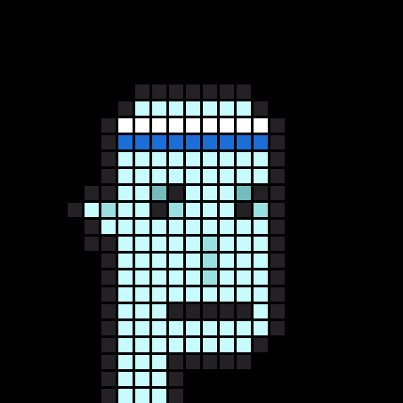
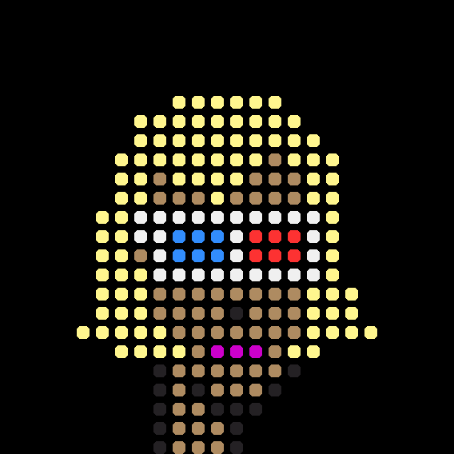
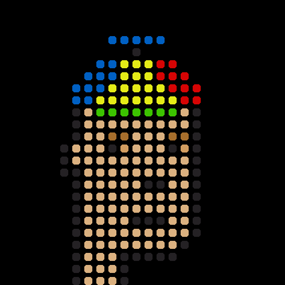

# LED Light Pixel Art Experiment


Mint yourself free CryptoPunks in the LED Light pixel art series.


Here's the experiment - let's turn 24x24 pixelated CryptoPunks
into LED Light art.

How?

1. Let's use a black background.
2. Let's change black pixels to a (lighter) shade of black (e.g. raisin black - rgb(36, 33, 36)).
3. Let's turn pixels into LEDs by scaling up the pixel (e.g. 8x).
4. Let's add spacing between the LEDs (e.g. 2 pixels).


## Alien Punk #3100


Let's try alien punk #3100. Let's mint a fresh 24x24 copy.


``` ruby
require 'cryptopunks'

punks = Punks::Image::Composite.read( './punks.png' )
punk = punks[ 3100 ]
punk.save( './punk-3100.png' )
```


And let's try three LED Light variants:

1.  LED - 8 pixels, Spacing - 2 pixels   (the default)
2.  LED - 16 pixels, Spacing - 3 pixels
3.  LED - 16 pixels, Spacing - 8 pixels, Round Corner - Turned On


``` ruby
punk = punk.change_colors( { 0xff => 0x242124ff } )

punk_led = punk.led( 8, spacing: 2 )
punk_led.save( './punk-3100_led8x.png' )

punk_led = punk.led( 16, spacing: 3 )
punk_led.save( './punk-3100_led16x.png' )

punk_led = punk.led( 16, spacing: 8, round_corner: true )
punk_led.save( './punk-3100_led16xr.png' )
```

And Voila!





## More Punks - Zombies, Blondes, Beanies & Friends

Let's try another batch of punks.
Let's mint a fresh copy of zombie #3393, blondie #172
and beanie #2964.


``` ruby
ids = [3393, 172, 2964]
ids.each do |id|
  name = '%04d' % id
  punk = punks[id]
  punk.save( "./punk-#{name}.png" )
end
```


And let's try three LED Light variants:

1.  LED - 8 pixels, Spacing - 2 pixels   (the default)
2.  LED - 16 pixels, Spacing - 3 pixels
3.  LED - 16 pixels, Spacing - 8 pixels, Round Corner - Turned On


Let's add inside the loop:

``` ruby
ids.each do |id|
  # ...   see above

  punk = punk.change_colors( { 0xff => 0x242124ff } )

  punk_led = punk.led( 8, spacing: 2 )
  punk_led.save( "./punk-#{name}_led8x.png" )

  punk_led = punk.led( 16, spacing: 3 )
  punk_led.save( "./punk-#{name}_led16x.png" )

  punk_led = punk.led( 16, spacing: 8, round_corner: true )
  punk_led.save( "./punk-#{name}_led16xr.png" )
end
```

And Voila!






##  Future Directions - Comments Welcome

Really not too bad for a first rough quick & dirty LED light experiment.


Ideas for future improvements:

- Scale-up pixels not as rectangles but as circles?
- Use different shaded colors for scaled-up pixels?
- Use a background off by 1 for each scaled-up pixel for a neon "glowing" light effect?
- Your ideas here?  Please, tell.


## Questions? Comments?

Post them on the [CryptoPunksDev reddit](https://old.reddit.com/r/CryptoPunksDev). Thanks.

